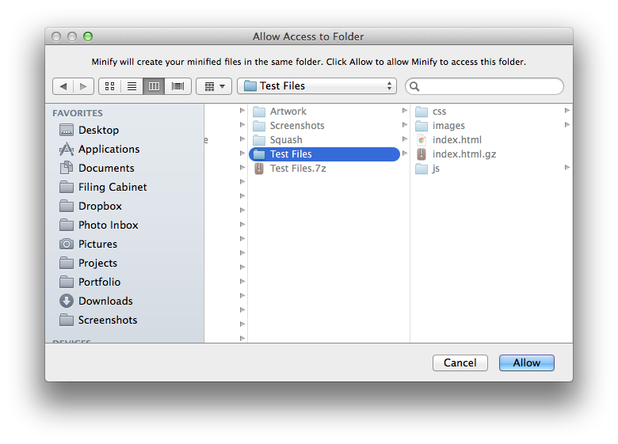

AppSandboxFileAccess
====================

A simple class that wraps up writing and accessing files outside a Mac apps App Sandbox files. The class will request permission from the user with a simple to understand dialog consistent with Apple's documentation and persist permissions across application runs using security bookmarks.

This is specifically useful for when you need to write files, or gain access to directories that are not already accessible to your application. For example if your application is introduced to file AwesomeRecipe.txt and wishes to generate AwesomeRecipe.txt.gz, this is not possible without gaining permission from the user. (Note: It is possible to write AwesomeRecipe.gz, you don't need this class to do that.)

When using this class, if the user needs to give permission to access the folder, the NSOpenPanel is used to request permission. Only the path or file requiring permission, or parent paths are selectable in the NSOpenPanel. The panel text, title and button are customisable.

Uses in the Real World
====================

http://minifyapp.com &ndash; Minify uses this code to write combined, minified and compressed files to the same directory as the original. E.g. styles.css is minified into styles.min.css, then compressed to styles.min.css.gz.

How to Use
====================

Include the source .h and .m files into your own project. If you'd like to keep up-to-date with the latest updates, add this project as a submodule to your application.

In Xcode click on your project file, then the Capabilities tab. Turn on App Sandbox and change 'User Selected File' to 'Read/Write' or 'Read Only', whichever you need. In your project Xcode will have created a .entitlements file. Open this and you should see the below. If you plan on persisting permissions you'll need to add the third entitlement.


In your application, whenever you need to read or write a file, wrap the code accessing the file wrap like the following. The following example will get permission to access the parent directory of a file the application already knows about.

```
#import "AppSandboxFileAccess.h"

...

// initialise the file access class
AppSandboxFileAccess *fileAccess = [AppSandboxFileAccess fileAccess];

// the application was provided this file when the user dragged this file on to the app
NSString *file = @"/Users/Wookie/AwesomeRecipe.txt";

// persist permission to access the file the user introduced to the app, so we can always 
// access it and then the AppSandboxFileAccess class won't prompt for it if you wrap access to it
[fileAccess persistPermission:fileUrl];

// get the parent directory for the file
NSString *parentDirectory = [file stringByDeletingLastPathComponent];
NSURL *parentUrl = [NSURL fileURLWithPath:parentDirectory];
				
// get access to the parent directory
BOOL accessAllowed = [fileAccess accessFile:[NSURL fileURLWithPath:file] withBlock:^{

  // write or read files in that directory
  // e.g. write AwesomeRecipe.txt.gz to the same directory as the txt file
  
} persistPermission:YES];

if (!accessAllowed) {
  NSLog(@"Sad Wookie");
}

```

License
====================

Copyright (c) 2013, Leigh McCulloch
All rights reserved.

BSD-2-Clause License: http://opensource.org/licenses/BSD-2-Clause

Redistribution and use in source and binary forms, with or without
modification, are permitted provided that the following conditions are
met:

1. Redistributions of source code must retain the above copyright
notice, this list of conditions and the following disclaimer.

2. Redistributions in binary form must reproduce the above copyright
notice, this list of conditions and the following disclaimer in the
documentation and/or other materials provided with the distribution.

THIS SOFTWARE IS PROVIDED BY THE COPYRIGHT HOLDERS AND CONTRIBUTORS "AS
IS" AND ANY EXPRESS OR IMPLIED WARRANTIES, INCLUDING, BUT NOT LIMITED
TO, THE IMPLIED WARRANTIES OF MERCHANTABILITY AND FITNESS FOR A
PARTICULAR PURPOSE ARE DISCLAIMED. IN NO EVENT SHALL THE COPYRIGHT
HOLDER OR CONTRIBUTORS BE LIABLE FOR ANY DIRECT, INDIRECT, INCIDENTAL,
SPECIAL, EXEMPLARY, OR CONSEQUENTIAL DAMAGES (INCLUDING, BUT NOT LIMITED
TO, PROCUREMENT OF SUBSTITUTE GOODS OR SERVICES; LOSS OF USE, DATA, OR
PROFITS; OR BUSINESS INTERRUPTION) HOWEVER CAUSED AND ON ANY THEORY OF
LIABILITY, WHETHER IN CONTRACT, STRICT LIABILITY, OR TORT (INCLUDING
NEGLIGENCE OR OTHERWISE) ARISING IN ANY WAY OUT OF THE USE OF THIS
SOFTWARE, EVEN IF ADVISED OF THE POSSIBILITY OF SUCH DAMAGE.
